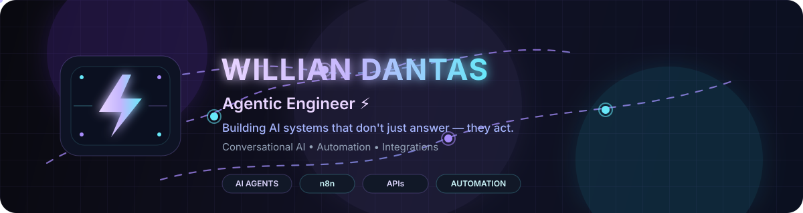

 

# Willian Dantas

### Agentic Engineer ⚡

**Building AI systems that don't just answer — they act.**

Conversational AI · Automation · Integrations

 

  

---

## About

I build agents, automations, and integrations that connect language to real execution.

> user intent → reasoning → tools → APIs → real outcome

---

## Focus

- AI Agents
- Workflow Automation
- API Integrations
- Conversational Systems
- Observability

---

## Stack

**Languages:** JavaScript, Python  
**Automation:** n8n  
**AI:** OpenAI, Claude  
**Tools:** REST APIs, Git, Docker, Postman, Datadog

---

**Turning conversations into systems that execute.**

